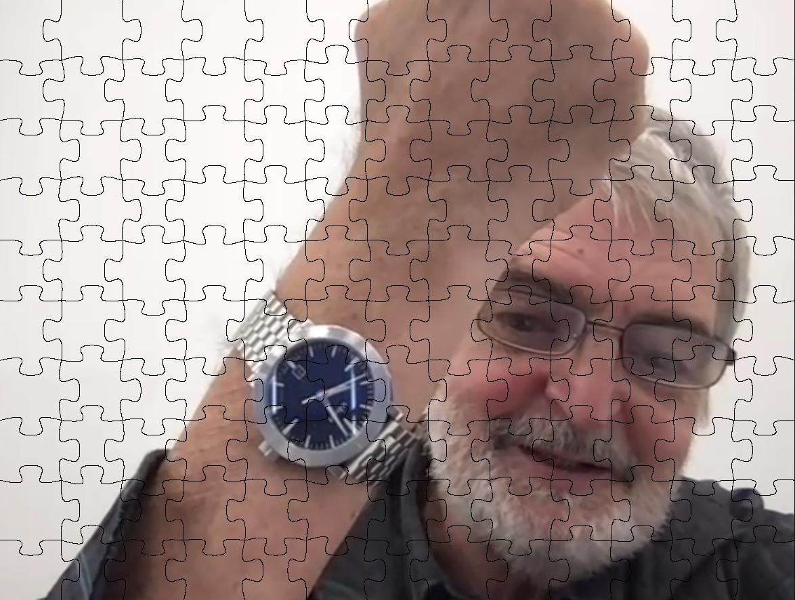

# Puzzle Generation

Turn any image into a jigsaw style puzzle, then save each piece as its own PNG with a transparent background.

<p align="center">
  
</p>

---

## What this project does

1. Draws curved tabs between tiles using cubic Bézier curves.
2. Builds one final puzzle image as JPG.
3. Exports every piece as a PNG with a transparent background.
4. Lets you pick the grid size, output folder, and random seed.

---

## Install

Python 3.8 or newer is recommended.
The project uses Pillow and NumPy.

---

## Quick start

```python
from puzzle_generation import create_puzzle, save_pieces

# 1. Create the full puzzle image
# Saved file name will include the total number of pieces
puzzle_path = create_puzzle("images/image.png", squares_in_row = 10, base_dir = "exports")
print("Puzzle saved at:", puzzle_path)

# 2. Save each puzzle piece
# Files go into exports/image100pcs_pieces for a 10x10 grid
pieces_dir = save_pieces("images/image.png", squares_in_row = 10, seed = 123, output_dir = "exports")
print("Pieces saved in:", pieces_dir)
```

---

## Examples

Use the sample image at `images/image.png` as a quick test. After running the quick start code, you should see:

```
exports/
  image100pieces.jpg
  image100pcs_pieces/
    image_piece-0_0.png
    image_piece-0_1.png
    ...
```

If you want a different grid, change `squares_in_row`. For example, 12 gives a 12 by 12 grid on a square image.

---

## Notes

- PNG is used for pieces because it supports transparency.
- JPG is used for the full image for smaller file size.
- Edge thickness in the mask can be tuned with `edge_thicken` if you notice gaps.
- If you pass a fixed `seed`, piece shapes repeat between runs.

---

## License

MIT
